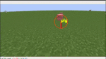
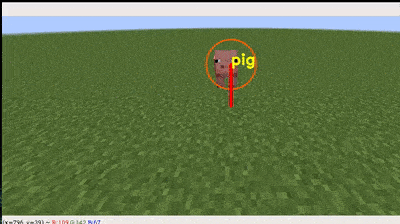
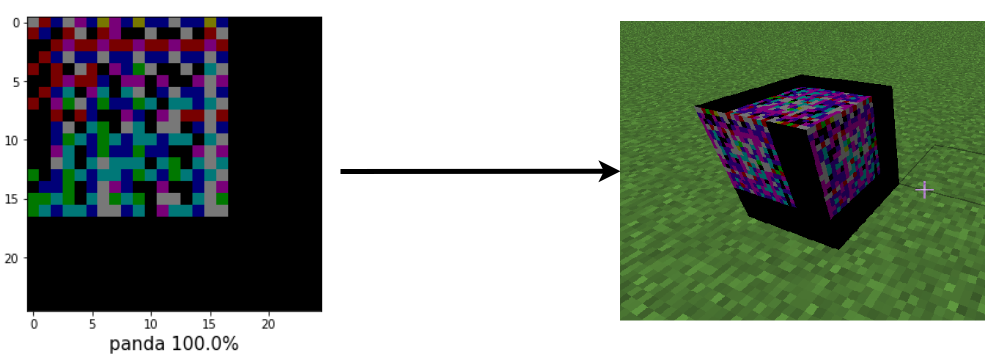
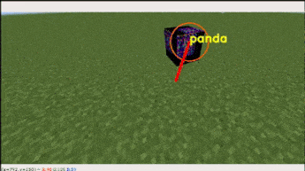
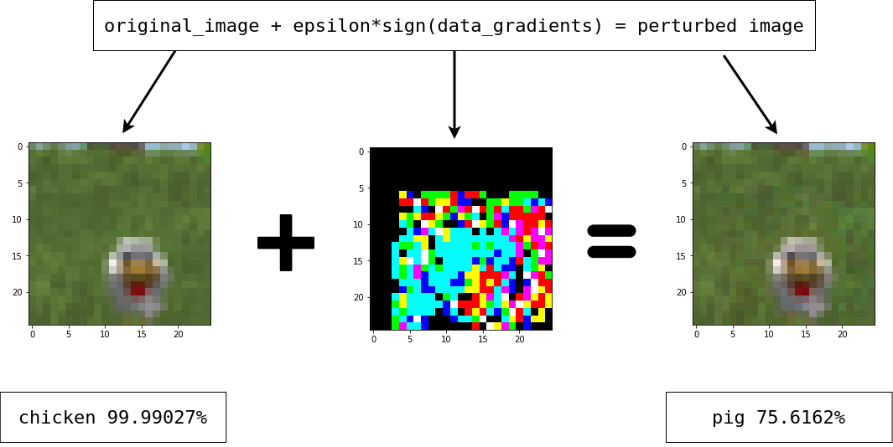
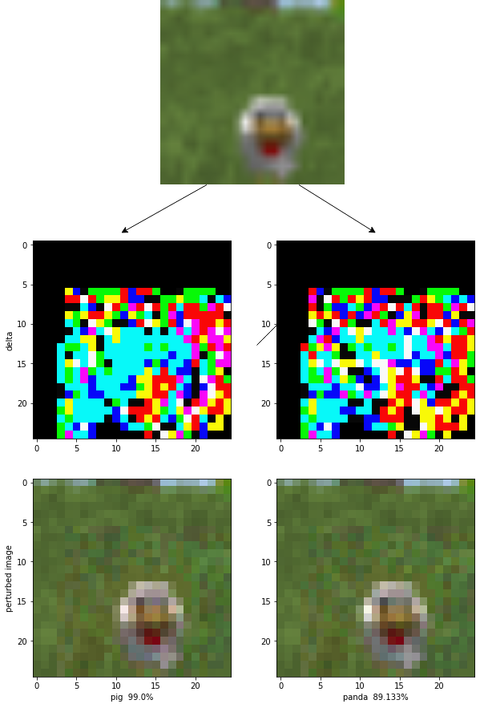
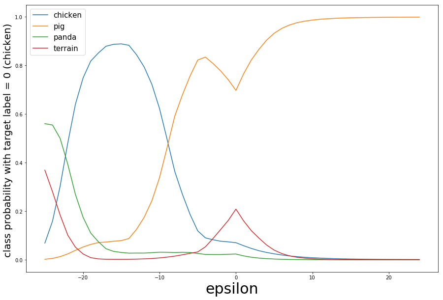
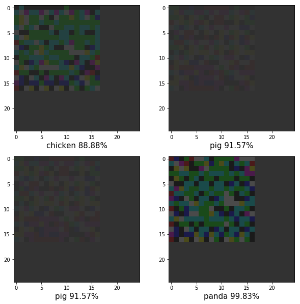

# deep-chicken-saviour :shield: :chicken:

## Before:

## After:

## Adversarial blocks generated by negative epsilon FGSM to confuse the traned deep neural network

## Fast Gradient Sign Method :chart_with_upwards_trend:

* `sign(data_gradients)` gives the element wise signs of the data gradient
* `epsilon` defines the "strength" of the perturbation of the image

In a nutshell, instead of **optimizing the model to reduce the loss**, we're **un-optimizing the input image to maximise loss**.

* This works primarily because of the piecewise linear nature of deep neural networks. For example, look at ReLU or at maxout functions, they're all piecewise linear. Even a carefully tuned sigmoid has an approximate linear nature when taken piecewise.

* With varying values of epsilon, we will see an approximately linear relationship between "confidence" and epsilon.

## Negative epsilon FGSM
* this can be used to turn one animal into another specific animal for the deep neural network

## How are the images "optimized" using the same FGSM ?
* The key here is to understand how FGSM actually worked.
In FGSM, we were tampering with the pixels which has a *positive* gradient and added a certain value `gradient * epsilon` to each of those pixels. This made the image deviate further and further away from the class it actually belongs to and thus maximising loss in the process. Note that this was done with a __positive epsilon__ value

But for our current objective, we will try to "optimize" the image to a different class. This can be done by:
* Doing a forward pass with an image of class `x` and with a label of `y`. Where `y` is the class to which we want to convert our image to. 
* Performing a backpropagation on the network and extracting the gradients on the input image.
* Now instead of trying to maximise loss using the FGSM, we'll reduce the loss with a __negative epsilon__ FGSM.
* This will help reduce the loss of the image with respect to the target class `y`, and with a sufficiently  negative epsilon value, the image gets mis-classified as the target class.

If you didn't read the boring stuff above, just remember that 
* A __positive epsilon__ value will __un-optimize__ the image 
* A __negative epsilon__ value will __optimize__ the image for the given label class

## Generating adversarial patches from black images 

